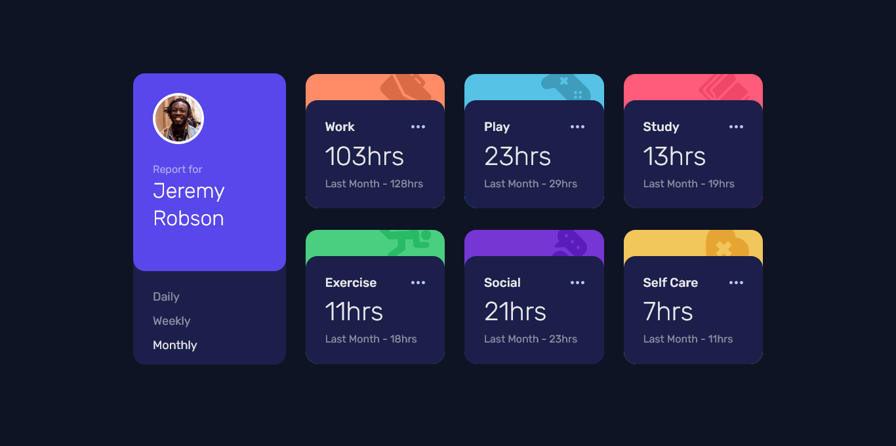

# Frontend Mentor - Time tracking dashboard solution

This is a solution to the [Time tracking dashboard challenge on Frontend Mentor](https://www.frontendmentor.io/challenges/time-tracking-dashboard-UIQ7167Jw).

## Table of contents

- [Overview](#overview)
  - [The challenge](#the-challenge)
  - [Screenshot](#screenshot)
  - [Links](#links)
- [My process](#my-process)
  - [Built with](#built-with)
- [Author](#author)

## Overview

### The challenge

Users should be able to:

- View the optimal layout for the site depending on their device's screen size
- See hover states for all interactive elements on the page
- Switch between viewing Daily, Weekly, and Monthly stats

### Expected behaviour

- The text for the previous period's time should change based on the active timeframe. For Daily, it should read "Yesterday" e.g "Yesterday - 2hrs". For Weekly, it should read "Last Week" e.g. "Last Week - 32hrs". For monthly, it should read "Last Month" e.g. "Last Month - 19hrs".

### Screenshot

### Links

- [Solution URL](https://www.frontendmentor.io/solutions/responsive-time-tracking-dashboard-with-vanilla-javascript-FOhRevu3vj)
- [Live Site URL](https://time-tracking-dashboard-frontend-me.netlify.app/)

## My process

### Built with

- `HTML`
- `CSS custom properties`
- `Flexbox`
- `CSS Grid`
- `JavaScript`

## Author

- Github - [Amanuel Chaka](https://github.com/AmanuelCh)
- Frontend Mentor - [@AmanuelCh](https://www.frontendmentor.io/profile/AmanuelCh)
- Telegram - [@sozoFe](https://t.me/sozoFe)
