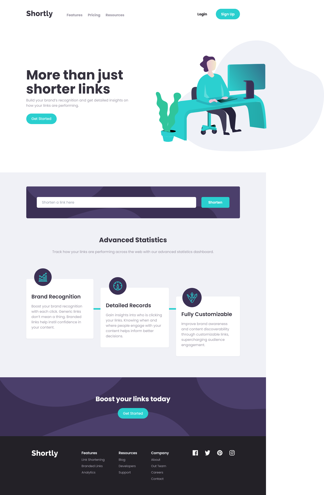

# Frontend Mentor - Shortly URL shortening API Challenge solution

This is a solution to the [Shortly URL shortening API Challenge challenge on Frontend Mentor](https://www.frontendmentor.io/challenges/url-shortening-api-landing-page-2ce3ob-G).

## Table of contents

- [Overview](#overview)
  - [The challenge](#the-challenge)
  - [Screenshot](#screenshot)
  - [Links](#links)
- [My process](#my-process)
  - [Built with](#built-with)
  - [Useful resources](#useful-resources)
- [Author](#author)

## Overview

### The challenge

Users should be able to:

- View the optimal layout for the site depending on their device's screen size
- Shorten any valid URL
- See a list of their shortened links, even after refreshing the browser
- Copy the shortened link to their clipboard in a single click
- Receive an error message when the `form` is submitted if:
  - The `input` field is empty

### Screenshot

### Links

- [Solution URL](https://www.frontendmentor.io/solutions/link-shortening-web-app-using-react-and-tailwind-yRDyH8WCci)
- [Live site](https://url-shortening-frontend-me.netlify.app/)

## My process

### Built with

- `React`
- `Tailwind CSS`
- `React toastify`

### Useful resources

- [React Toastify](https://fkhadra.github.io/react-toastify/introduction)

## Author

- Frontend Mentor - [@AmanuelCh](https://www.frontendmentor.io/profile/AmanuelCh)
